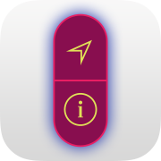
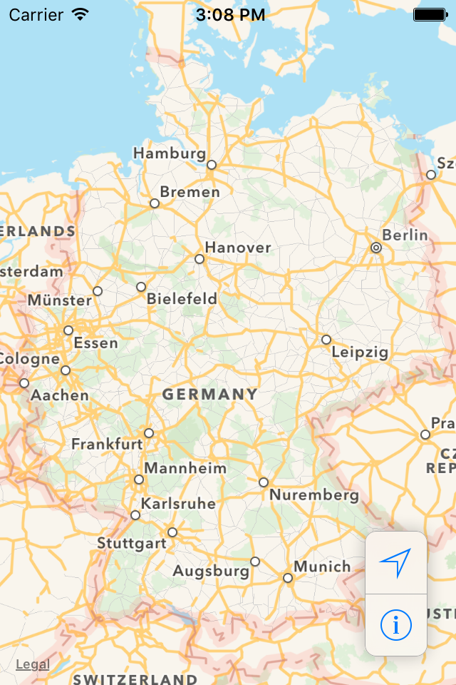
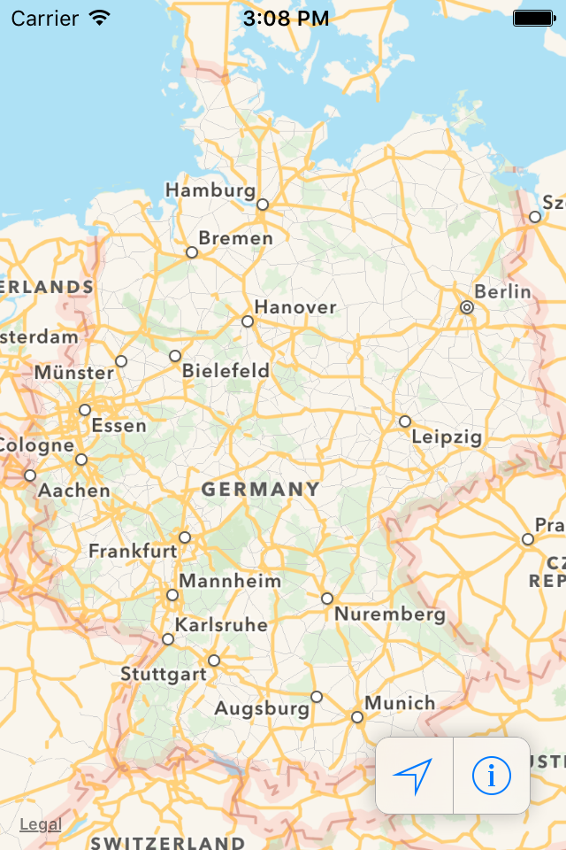

#  ISHHoverBar

[](http://travis-ci.org/iosphere/ISHHoverBar)&nbsp;
[](http://cocoadocs.org/docsets/ISHHoverBar)&nbsp;
[](https://github.com/Carthage/Carthage)

**A floating `UIToolBar` replacement as seen in the iOS 10 Maps app, supporting both vertical and horizontal orientation.**  

It is designed to hover above your content and it plays nicely with auto layout. Combine 
it with [`ISHPullUp`](https://github.com/iosphere/ISHPullUp) to create a UI resembling the 
iOS 10 Maps app.

`ISHHoverBarOrientationVertical` |  `ISHHoverBarOrientationHorizontal`
:-------------------------:|:-------------------------:
 | 

The content of the bar is set using `UIBarButtonItem`s, just as you would configure a `UIToolBar`. 
The bar is backed by a `UIVisualEffectsView` allowing you to choose from several styles. 
You can customize most aspects of the view via *Interface Builder*.

## Basic usage

### Setting the bar's contents

`ISHHoverBar` is populated similarly to a `UIToolbar` using instances of 
`UIBarButtonItem`. The content can be changed at any time by setting the `items` property.
The layout and `intrinsicContentSize` will automatically be updated.

A few limitation apply: `ISHHoverBar` only supports instances of `UIBarButtonItem` that 
have a `title`, `image`, or `customView` (subclass of `UIControl`). Most importantly, 
`UIBarButtonItem` instances created using a `UIBarButtonSystemItem` are not supported as 
access to the underlying content is restricted to private APIs.

### Appearance and orientation

`ISHHoverBar` supports vertical and horizontal layouts. The orientation can be changed 
at any time by setting the `orientation` property (default is vertical). Use auto layout 
to position the bar in your view hierarchy.

The following aspects of `ISHHoverBar` can be changed via code or *Interface Builder*:

* Shadow: 
  * `shadowColor`
  * `shadowOpacity`
  * `shadowRadius`
* Corner radius: `cornerRadius`
* Border (also applied to separators between items):
  * `borderWidth`
  * `borderColor`
* Background visual effect: `effect`
  
## General info

`ISHHoverBar` is written in **Objective-C** to allow easy integration into any iOS project 
and has fully documented headers. It is annotated for easy integration into 
*Swift* code bases.

The `ISHHoverBar` class and sample app have a **Deployment Target** of **iOS 8**.

## Integration into your project

### Dynamically-linked framework

Add the project file `ISHHoverBar.xcodeproj` as a subproject of your app. 
Then add the framework `ISHHoverBar.framework` to the app's embedded binaries 
(on the *General* tab of your app target's settings). On the *Build Phases* tab, 
verify that the framework has also been added to the *Link Binary with
Libraries* phase, and that an *Embed Frameworks* phase has been created (unless
it existed before).

The framework can be used as a module, so you can use `@import ISHHoverBar;`
(Objective-C) and `import ISHHoverBar` (Swift) to import all public headers. 

Further reading on Modules: 
[Clang Documentation](http://clang.llvm.org/docs/Modules.html)

### Include files directly

Currently the project relies on a single implementation file and its header. 
You can include them directly into your project:

* `ISHHoverBar/ISHHoverBar.`{`h`/`m`}

### CocoaPods

You can use CocoaPods to install `ISHHoverBar` as a static library. Add this
to your Podfile:

```ruby
target 'MyApp' do
  pod 'ISHHoverBar'
end
```

`ISHHoverBar` can also be installed as a framework:

```ruby
target 'MyApp' do
  use_frameworks!
  pod 'ISHHoverBar'
end
```

See the [official website](https://cocoapods.org/#get_started) to get started with
CocoaPods.

### Carthage

Since `ISHHoverBar` can be built as a framework, it supports Carthage, too. Add
this to your Cartfile:

```
github iosphere/ISHHoverBar
```

See the [Carthage repository](https://github.com/Carthage/Carthage) to get started
with Carthage.

## More OpenSource projects by iosphere

 [`ISHPermissionKit`](https://github.com/iosphere/ISHPermissionKit) - A polite and unified way of asking for permission on iOS

 [`ISHPullUp`](https://github.com/iosphere/ISHPullUp) - Vertical split view controller with pull up gesture as seen in the iOS 10 Maps app

## TODO

* [ ] Allow changing the orientation with an animation
* [ ] Allow changing the items with an animation
